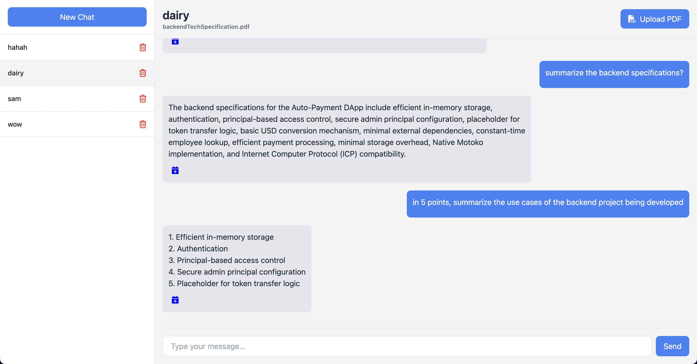

# Genie - Social Media Management Platform

Genie is an AI-powered social media management platform that helps you manage and automate your OpenChat presence from across multiple platforms.

## Features

- **Content Scheduling**

  - Schedule posts for your OpenChat account,group or community
  - Manage content calendar
  - Preview scheduled content

- **AI content generation**
  - Use AI to generate content for scheduling
  - Upload and generate content from custom PDF documents uploaded to the platform
  - Smart AI chat about your uploaded documents

- **Analytics**
  - Track engagement metrics
  - Monitor performance across platforms
  - Generate insights reports

## Tech Stack

### Frontend

- React.js
- TailwindCSS
- Shadcn/ui Components
- Internet Identity Authentication

### Backend
- Node.js
- Express
- MongoDB
- Telegram Bot API
- Discord Bot API
- OpenChat Integration
